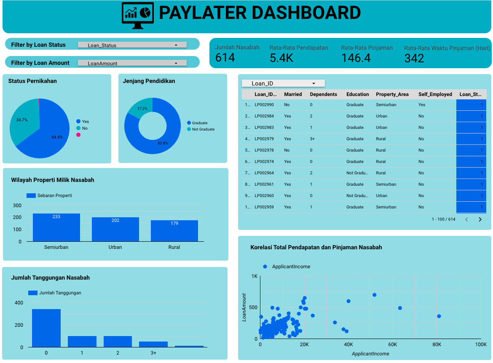
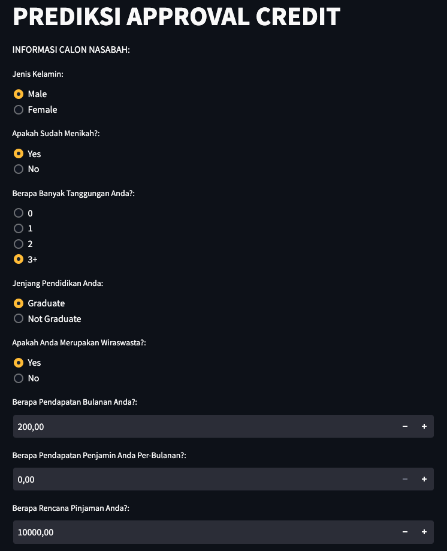

# Paylater-Approval-Prediction

Proyek ini bertujuan untuk mengembangkan model machine learning sederhana yang dapat memprediksi hasil persetujuan atau penolakan suatu pengajuan kredit. Dengan menggunakan metode Naive Bayes, model ini dianalisis berdasarkan hasil cross-validation, hyperparameter tuning, dan skor akurasi.

Hasil analisis menunjukkan bahwa model Naive Bayes memberikan nilai cross-validation terbaik, namun skor akurasi masih sekitar 80%. Meskipun tergolong sebagai model yang cocok, peneliti menyarankan evaluasi lebih lanjut untuk meningkatkan tingkat akurasi.

Analisis secara keseluruhan melibatkan penerapan business knowledge dalam menambahkan fitur yang dianggap penting meskipun memiliki korelasi rendah. Model ini diharapkan dapat membantu tim Account Officer dalam penilaian pengajuan kredit tradisional, meskipun perlu perbaikan lebih lanjut.

Data yang digunakan mencakup informasi seperti ; 
1. jenis kelamin
2. status pernikahan
3. jumlah tanggungan
4. pendidikan
5. pekerja mandiri
6. pendapatan peminjam
7. pendapatan pasangan
8. jumlah pinjaman
9. jangka waktu pinjaman
10. riwayat kredit
11. lokasi tempat tinggal

Kelebihan proyek ini melibatkan penerapan business knowledge dalam pemilihan fitur atau data yang digunakan, dimana ilmu tersebut peneliti pelajari selama berkuliah terkait perbankan. Namun, masih terdapat kekurangan dalam akurasi model sehingga peneliti belum dapat mengimplementasikan model tersebut di perusahaan.

- Dashboard: [Link Dashboard](https://lookerstudio.google.com/u/0/reporting/7ae4b1b7-b53e-4b32-a8af-35244aa2718c/page/qRwwC/edit)

- Deployment Model: [Link Deployment Model](https://huggingface.co/spaces/Dzlkrn/ML2)

